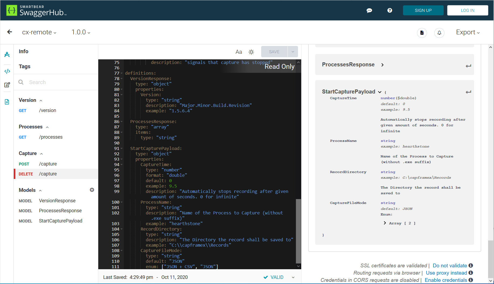

# CXRemote
Remote Controller Interface for CapFrameX

View OpenApi Specififation on [SwaggerHub](https://app.swaggerhub.com/apis/CapFrameX/cx-remote)

If you want to use the "try it out" function of swaggerhub, make sure to toggle _Routing requests to "Use browser instead"_ and Credentials in CORS requests to "disabled" at the bottom of the Page

Compatible with CX >= v1.5.6: https://github.com/CXWorld/CapFrameX/releases

